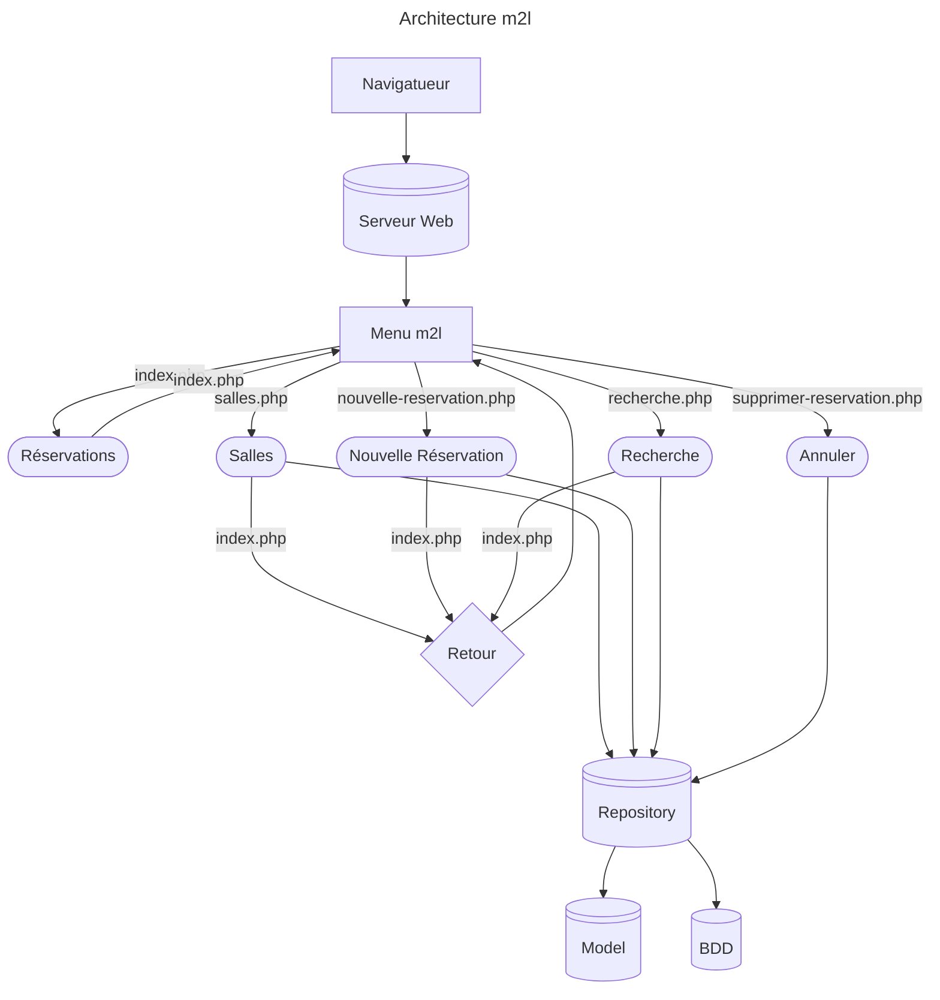

# Analyse architecture m2l

```mermaid
---
title: Architecture m2l
---
graph TD
    %% Blocs
    A[Menu m2l]
    B([Réservations])
    C([Salles])
    D([Nouvelle Réservation])
    E([Recherche])
    F[(BDD)]
    G{Retour}
    H@{shape: lin-cyl, label: Model}
    I@{shape: lin-cyl, label: Repository}
    J([Annuler])
    K[Navigatueur]
    L@{shape: lin-cyl, label: Serveur Web}
    
    %% jsp
    K --> L --> A
    
    %% Pages Menu
    A -- index.php --> B
    B -- index.php --> A
    A -- salles.php --> C
    A -- nouvelle-reservation.php --> D
    A -- recherche.php --> E
    G ----> A
    A -- supprimer-reservation.php --> J
    
    %% Salles
    C -- index.php --> G
    C ----> I
    
    %% Nouvelle Reservation
    D -- "index.php" --> G
    D ----> I
    
    %% Recherche
    E -- index.php --> G
    E ----> I
    
    %% Annuler
    J ----> I 
    
    %% Repository
    I --> H
    I --> F
```
